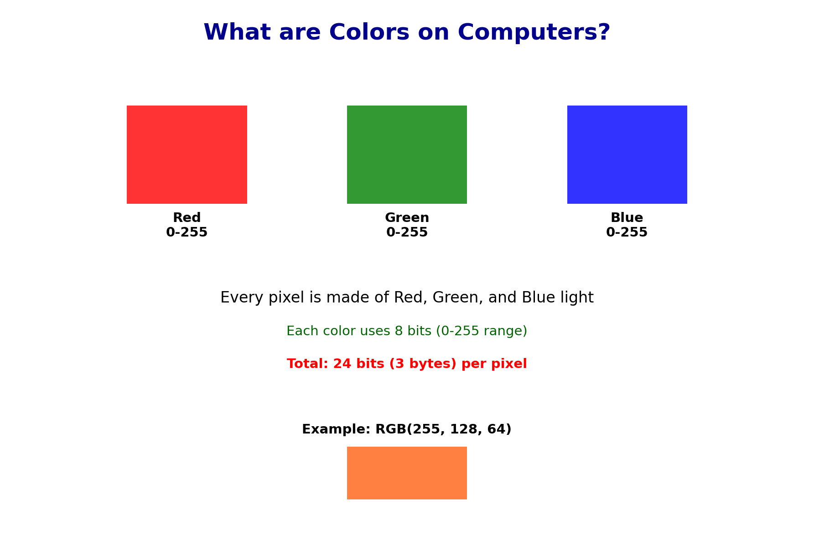
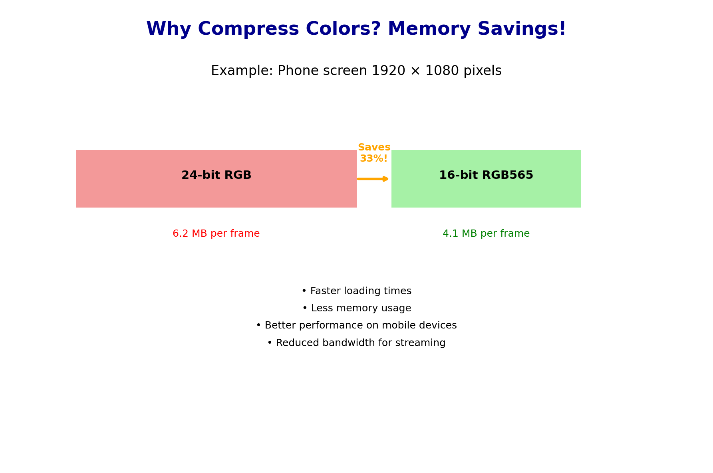
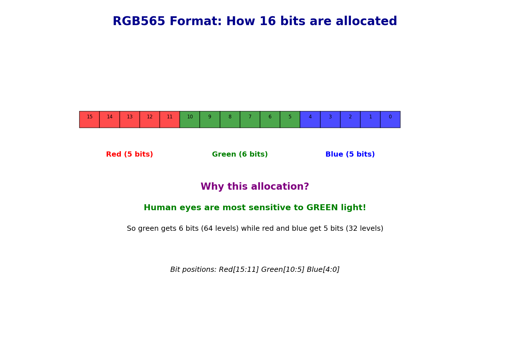
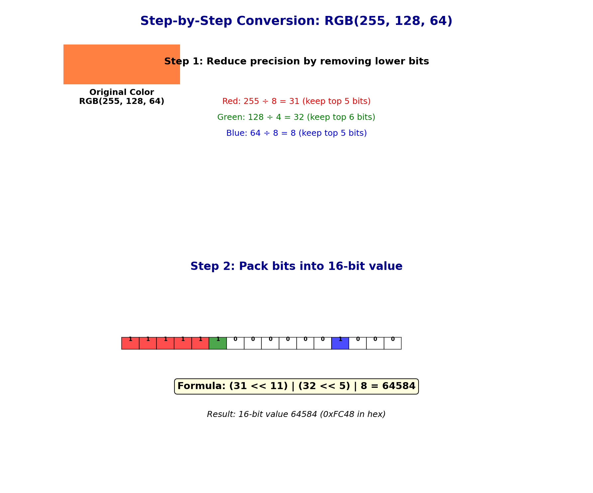
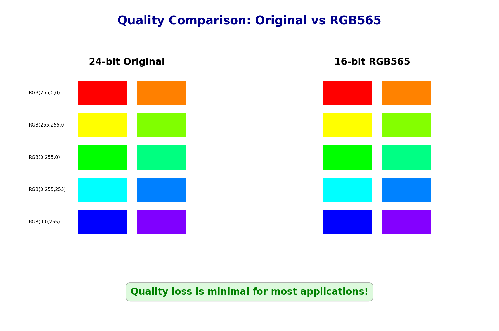
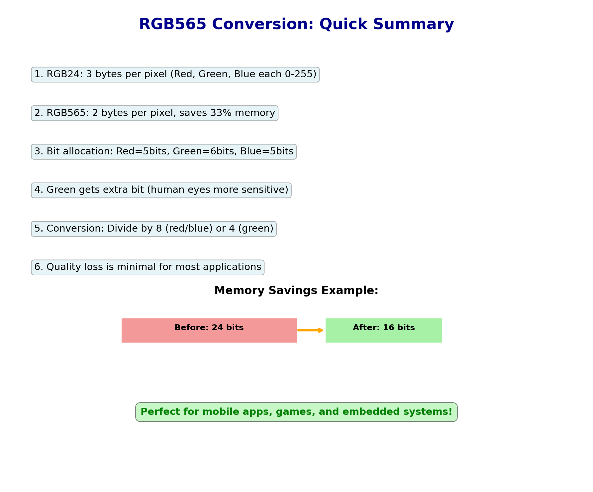

# week_10_sbu_102
# RGB565 Color Conversion Assignment

## Background: Color Representation

A screen color typically has **Red**, **Green**, and **Blue** brightness values, each ranging from 0–255 (8 bits per channel). This gives us **24-bit color** with 16.7 million possible colors.

However, some devices need to save memory/bandwidth and use a smaller **16-bit format** called **RGB565**. This sacrifices some color precision but reduces storage by 33%.


*Figure 1: Understanding RGB color representation - how computers create colors using Red, Green, and Blue components*

## Why RGB565 is Necessary: Memory Savings

Consider a modern display with **1920×1440 resolution** (2,764,800 pixels):

**24-bit RGB (3 bytes per pixel):**
- Memory per frame: 1920 × 1440 × 3 = **8,294,400 bytes** ≈ **8.3 MB**

**16-bit RGB565 (2 bytes per pixel):**  
- Memory per frame: 1920 × 1440 × 2 = **5,529,600 bytes** ≈ **5.5 MB**

**Memory savings:** 8.3 - 5.5 = **2.8 MB per frame** (33% reduction!)

This becomes critical when you consider:
- **Mobile devices** with limited RAM
- **Embedded systems** with tight memory constraints  
- **GPU framebuffers** storing multiple frames
- **Video streaming** where every byte counts for bandwidth
- **Game textures** where hundreds of images need to fit in memory

For a 60 FPS video game, this saves **168 MB per second** of framebuffer data!


*Figure 2: Memory usage comparison showing why RGB565 compression is essential for mobile and embedded devices*

## RGB565 Format Scheme

RGB565 packs RGB values into 16 bits with the following bit allocation:

```
+---------+---------+---------+
|  Red    | Green   |  Blue   |
| 5 bits  | 6 bits  | 5 bits  |
+---------+---------+---------+
15    11 10      5 4        0
```

**Why this allocation?**
- **Green gets 6 bits** because human eyes are most sensitive to green light
- **Red and Blue get 5 bits each** for the remaining 10 bits


*Figure 3: RGB565 bit allocation showing how 16 bits are distributed among Red (5), Green (6), and Blue (5) channels*

## Step-by-Step Implementation: 24-bit RGB → RGB565

### Step 1: Convert 8-bit values to reduced precision
```c
// From 8-bit (0-255) to 5-bit (0-31) for Red and Blue
uint16_t r5 = r8 >> 3;  // Keep upper 5 bits, discard lower 3
uint16_t b5 = b8 >> 3;  // Keep upper 5 bits, discard lower 3

// From 8-bit (0-255) to 6-bit (0-63) for Green  
uint16_t g6 = g8 >> 2;  // Keep upper 6 bits, discard lower 2
```

### Step 2: Pack the bits into 16-bit value
```c
uint16_t rgb565 = (r5 << 11) | (g6 << 5) | b5;
```

**Bit shifting explanation:**
- `r5 << 11`: Move 5-bit red to bits 15-11
- `g6 << 5`: Move 6-bit green to bits 10-5  
- `b5`: Blue stays in bits 4-0
- `|` (OR): Combine all three components

### Example
Convert RGB(255, 128, 64):
1. `r5 = 255 >> 3 = 31` (0x1F)
2. `g6 = 128 >> 2 = 32` (0x20) 
3. `b5 = 64 >> 3 = 8` (0x08)
4. `rgb565 = (31 << 11) | (32 << 5) | 8 = 0xFC48`


*Figure 4: Step-by-step visual breakdown of converting RGB(255, 128, 64) to RGB565 format*

## Homework Assignment

**Your task is to implement the REVERSE conversion**: RGB565 → 24-bit RGB

Complete these functions in [`starter.c`](starter.c):

### 1. `pack_rgb565(r8, g8, b8)` 
- **Input**: 3 brightness values (0–255)
- **Output**: 16-bit RGB565 value
- **Hint**: Follow the step-by-step implementation above

### 2. Reverse Conversion Functions (YOUR CHALLENGE!)

Implement these three functions to extract RGB values from RGB565:

#### `unpack_r8(uint16_t rgb565)`
- **Input**: 16-bit RGB565 value
- **Output**: 8-bit red component (0–255)
- **Steps**:
  1. Extract 5-bit red: `r5 = (rgb565 >> 11) & 0x1F`
  2. Expand to 8-bit: `r8 = (r5 << 3) | (r5 >> 2)`

#### `unpack_g8(uint16_t rgb565)`
- **Input**: 16-bit RGB565 value  
- **Output**: 8-bit green component (0–255)
- **Hint**: Green is in bits 10-5, use mask `0x3F`

#### `unpack_b8(uint16_t rgb565)`
- **Input**: 16-bit RGB565 value
- **Output**: 8-bit blue component (0–255)  
- **Hint**: Blue is in bits 4-0, use mask `0x1F`

## Key Concepts to Remember

1. **Bit shifting** (`>>`, `<<`) for moving bits to correct positions
2. **Bit masking** (`&`) for extracting specific bit ranges  
3. **Bit expansion** using `(value << n) | (value >> m)` to fill lost precision
4. **Data types**: use `uint8_t` for 8-bit values, `uint16_t` for 16-bit

## Testing Your Code

Run your program to verify the conversions work correctly. The color values should be approximately correct after the round-trip conversion (some precision loss is expected).


*Figure 5: Quality comparison showing original 24-bit colors vs RGB565 compressed versions*

## Visual Summary


*Figure 6: Complete RGB565 summary showing key concepts, memory savings, and applications*

## Educational Resources

This assignment includes comprehensive educational materials:

### Video Tutorial
- **rgb565_explanation.mp4** - Complete 44-second educational video perfect for classroom use

### Interactive Tools  
- **interactive_rgb565_demo.py** - Hands-on demo tool to experiment with RGB conversion
- **animated_rgb565_demo.py** - Step-by-step animated explanation

Run the interactive demo to experiment with different RGB values:
```bash
python3 interactive_rgb565_demo.py
```

### Complete Educational Package
See **RGB565_EDUCATIONAL_GUIDE.md** for the complete learning package including all visualization tools and detailed explanations.